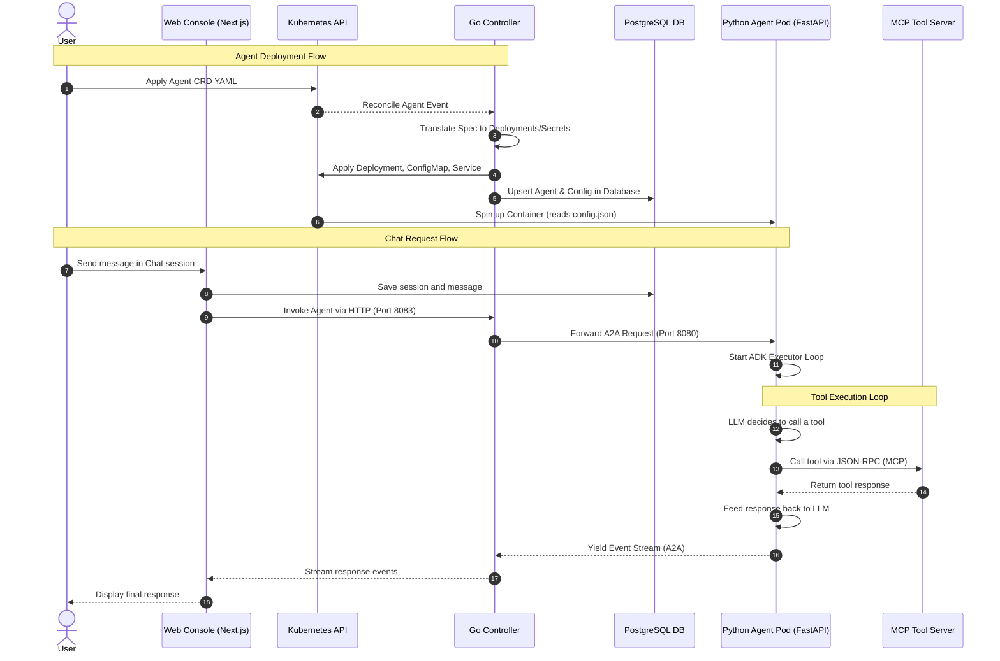

# `kagent` Architecture Walkthrough & Codebase Guide

`kagent` is a Kubernetes-native framework for deploying and managing AI agents. This document details the internal architecture, codebase layout, and request execution flows to help you start writing features.

---

## 1. High-Level Architecture

The framework consists of five main components:

1. **Kubernetes Controller / Operator (Go)**: Reconciles custom resources (CRDs) and translates them into standard Kubernetes manifests.
2. **Agent Engine / Runtime (Python)**: The containerized process running inside the agent pods. It runs a FastAPI/Uvicorn server hosting the Google ADK execution loop.
3. **MCP Tool Servers**: External or in-cluster tool servers (KMCP) providing capabilities (like running CLI commands or querying APIs) to the agents.
4. **PostgreSQL Database**: Persists agents, tool configurations, chat sessions, and history.
5. **Next.js Web Console (UI)**: Provides a dashboard to chat with agents, view traces, and inspect tool definitions.

### Component Interaction Diagram



---

## 2. Codebase Layout & Critical Modules

### A. The Go Operators & CLI (`/go`)
* **[go/api/v1alpha2/](file:///Users/apple/Open-Source/kagent/go/api/v1alpha2)**: Defines the Kubernetes Custom Resource schemas.
  * `agent_types.go`: Structures for `Agent` and `SandboxAgent`.
  * `modelconfig_types.go`: Structures for model provider configurations.
  * `remotemcpserver_types.go`: Structures for external Model Context Protocol tool servers.
* **[go/core/internal/controller/](file:///Users/apple/Open-Source/kagent/go/core/internal/controller)**: The controller reconciler logic.
  * `agent_controller.go`: Sets up Kubernetes watches and registers reconcilers.
  * `reconciler/reconciler.go`: The central reconciliation loop (`reconcileAgent`, `ReconcileKagentRemoteMCPServer`, etc.) that compiles CRD configurations and applies Kubernetes manifests.
* **[go/core/internal/controller/translator/agent/](file:///Users/apple/Open-Source/kagent/go/core/internal/controller/translator/agent)**: Performs structural translation of configurations.
  * `compiler.go`: Gathers dependencies (ModelConfigs, MCP tools) and compiles them into a unified `AgentManifestInputs`.
  * `manifest_builder.go`: Emits the actual `corev1.Secret` containing `config.json`, the `appsv1.Deployment`, and the `corev1.Service`.
  * `deployments.go`: Resolves resource settings, environment variables, and volumes for the agent pods.

### B. The Python ADK Engine (`/python`)
* **[python/packages/kagent-adk/src/kagent/adk/](file:///Users/apple/Open-Source/kagent/python/packages/kagent-adk/src/kagent/adk)**: The agent runner framework built on top of Google ADK.
  * `cli.py`: The CLI entry point. Runs the agent FastAPI app via `uvicorn` using `static` (which reads from `/config/config.json`).
  * `_a2a.py`: Implements the `KAgentApp` wrapper around the Agent-to-Agent protocol server, exposing `/health` and setting up the runner.
  * `_agent_executor.py`: Implements the execution loop `A2aAgentExecutor`, running the Google ADK agent and streaming JSON-RPC task updates/events back to the controller.
  * `_mcp_toolset.py`: Integrates Model Context Protocol (MCP) clients, enabling the agent to communicate with MCP Tool Servers.
  * `_memory_service.py` & `_session_service.py`: Hooks up agent memory and chat histories to the main backend services.

---

## 3. Step-by-Step Execution Walkthrough

### Step 1: Resource Creation & Reconciliation
When you run `kubectl apply -f agent.yaml`, the Go `agent-controller` detects the change:
1. `agent_controller.go` triggers `ReconcileKagentAgent` in [reconciler.go](file:///Users/apple/Open-Source/kagent/go/core/internal/controller/reconciler/reconciler.go).
2. It compiles the configuration via `CompileAgent` in [compiler.go](file:///Users/apple/Open-Source/kagent/go/core/internal/controller/translator/agent/compiler.go). This reads referenced `ModelConfig`s and resolves the URL/headers for any referenced `RemoteMCPServer`s.
3. It builds K8s manifests using `BuildManifest` in [manifest_builder.go](file:///Users/apple/Open-Source/kagent/go/core/internal/controller/translator/agent/manifest_builder.go).
   * It serializes the config to a Secret containing `config.json` and `agent-card.json`.
   * It generates a deployment specifying the runner image (e.g., Python runtime) and mounting the Secret under `/config`.
   * It generates a service pointing to the agent pod.
4. It calls `upsertAgent` to register the agent name and configuration JSON directly in the PostgreSQL database.
5. The Kubernetes scheduler spins up the agent pod in the cluster.

### Step 2: Pod Startup & Server Init
The container runs the command:
```bash
kagent-adk static --filepath /config --port 8080
```
1. `cli.py` reads `/config/config.json` and loads it into a Pydantic `AgentConfig` model.
2. It calls `agent_config.to_agent()` to instantiate a Google ADK `BaseAgent` with the configured LLM client (OpenAI, Anthropic, Gemini, etc.) and MCP Toolsets.
3. It builds a FastAPI application (`KAgentApp` in `_a2a.py`) with routes representing the agent and registers endpoints for health checks.
4. The server runs on port `8080`.

### Step 3: Handling Requests (Chatting / Tasks)
When a message is sent via the UI:
1. The message and session details are persisted to the database.
2. The UI sends the request to the controller's A2A proxy (`/api/a2a/kagent/<agent-name>/`).
3. The controller proxies the request to the agent pod's endpoint on port `8080`.
4. In `_agent_executor.py`, `A2aAgentExecutor.execute` kicks off:
   * It calls `Runner.run_async` to invoke the underlying agent execution loop.
   * If the agent decides it needs to run a tool, the engine dials the MCP server (e.g., in-cluster KMCP or external RemoteMCPServer) over SSE or Streamable HTTP, sends a JSON-RPC request to execute the tool, and feeds the response back to the LLM.
   * All intermediate events (LLM thoughts, tool calls, and print outputs) are streamed back as A2A task update events.
5. Once final output is produced, the event stream finishes and the controller yields the aggregated response to the client.

---

## 4. How to Implement New Features

### Feature Category 1: Extending the Agent Specification (CRD Changes)
If you want to add a field to control agent behaviors (e.g., code execution limits, custom runtime headers, new memory knobs):
1. **Define the fields**: Modify Go structs in [agent_types.go](file:///Users/apple/Open-Source/kagent/go/api/v1alpha2/agent_types.go) under `DeclarativeAgentSpec` or `SharedDeploymentSpec`.
2. **Run codegen**: Run `make controller-manifests` at the root directory to generate deepcopy helper methods and regenerate Helm CRD manifests.
3. **Update translation logic**:
   * If the field affects the pod structure (like volume mounts, environments, or replica count), map it in `resolveInlineDeployment` in [deployments.go](file:///Users/apple/Open-Source/kagent/go/core/internal/controller/translator/agent/deployments.go).
   * If it goes to the agent runtime, map it in `translateInlineAgent` in [compiler.go](file:///Users/apple/Open-Source/kagent/go/core/internal/controller/translator/agent/compiler.go) so it ends up in the `config.json` output config.
4. **Update Python ADK model**: Mirror the field in `go/api/adk/types.go` (`AgentConfig` struct) and [types.py](file:///Users/apple/Open-Source/kagent/python/packages/kagent-adk/src/kagent/adk/types.py) (`AgentConfig` Pydantic class).
5. **Update Runtime Execution**: Read the new field in [_agent_executor.py](file:///Users/apple/Open-Source/kagent/python/packages/kagent-adk/src/kagent/adk/_agent_executor.py) or `to_agent()` function in `types.py` and apply it to the LLM agent/tool lifecycle.
6. **Regenerate Golden Files & Test**:
   ```bash
   UPDATE_GOLDEN=true make -C go test
   ```

### Feature Category 2: Modifying Controller/Reconciliation Logic
If you want to add custom validation rules, database migrations, or support new resource watching:
1. **Validation rules**: Add checks in `validateAgent` within [compiler.go](file:///Users/apple/Open-Source/kagent/go/core/internal/controller/translator/agent/compiler.go) or status checks inside `reconciler.go`.
2. **Watches**: Register watches for new resource dependencies in `SetupWithManager` in `agent_controller.go`.
3. **Database migrations**: `kagent` uses `sqlc` for database access. If database models change, edit the schema and queries under `go/api/database/` or internal database folders and run `sqlc generate`.
